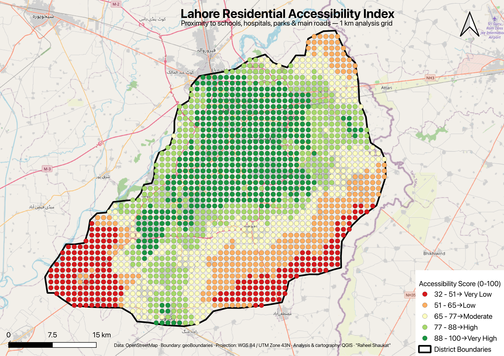

# Lahore Residential Accessibility Index

A GIS analysis that scores every part of Lahore district by how easily residents can reach four categories of essential urban services — **schools, hospitals, parks, and main roads**. The output is a single 0–100 accessibility score mapped across the city, the kind of location-intelligence layer used by property platforms to explain *why* one neighbourhood is more desirable than another.



> Replace the image above with your exported map file. Keep the PNG in the repository root (or update the path) so it renders on GitHub.

---

## The question

Where in Lahore do residents have the best — and worst — access to everyday services, and how does that access vary across the district? Property value is driven heavily by location convenience, so a defensible, data-driven accessibility score is directly useful for real-estate and urban-planning decisions.

## Key findings

- Accessibility is highest through the established central corridor (Gulberg, Model Town, Township, Johar Town and surrounding areas), which score in the "High" to "Very High" bands.
- Scores decline steadily toward the rural southern and eastern fringes of the district, which fall into the "Low" and "Very Low" bands.
- This gradient closely tracks known residential property-value patterns in Lahore, which serves as an informal validation of the model.

## Data sources

| Layer | Source | Licence |
|---|---|---|
| Schools, hospitals, parks, primary & secondary roads | OpenStreetMap (extracted via the QuickOSM plugin / Overpass API) | ODbL |
| Lahore district boundary | geoBoundaries (ADM2) | CC BY 4.0 |
| Basemap | OpenStreetMap standard tiles | ODbL |

All input data is open and freely available. Attribution is included on the map and required under the respective licences.

## Methodology

1. **Extraction** — Pulled amenity data from OpenStreetMap with QuickOSM, bounded to the Lahore study area. Point and polygon features for the same category (e.g. schools mapped as both nodes and building footprints) were reconciled by converting polygons to centroids and merging them into a single point layer per category.
2. **Projection** — Reprojected all layers to **EPSG:32643 (WGS 84 / UTM Zone 43N)** so every distance is measured in metres rather than degrees.
3. **Clipping** — Clipped all inputs to the district boundary to constrain the analysis to Lahore.
4. **Analysis grid** — Generated a **1 km grid of 1,670 cells** covering the district as the unit of analysis.
5. **Proximity** — For each grid cell, calculated the straight-line distance to the nearest school, hospital, park, and main road ("distance to nearest hub").
6. **Scoring** — Applied min-max normalisation to each of the four distance measures and inverted them (closer = higher score, on a 0–100 scale), then combined them into a weighted accessibility score. This is a standard Multi-Criteria Evaluation (MCE) approach.
7. **Cartography** — Symbolised the result as a graduated red-to-green surface using Natural Breaks (Jenks) classification, and composed a print layout with legend, scale bar, north arrow, and source attribution.

## Scoring model

Each criterion is normalised independently so that no single tightly-clustered amenity dominates the result. The weighted combination reflects the relative importance of each service category to residential desirability:

| Criterion | Weight |
|---|---|
| Distance to nearest school | 0.40 |
| Distance to nearest hospital | 0.30 |
| Distance to nearest park | 0.15 |
| Distance to nearest main road | 0.15 |

```
score = (school_closeness × 0.40)
      + (hospital_closeness × 0.30)
      + (park_closeness × 0.15)
      + (road_closeness × 0.15)
```

Where each `*_closeness` term is the min-max normalised, inverted distance scaled to 0–100. The final score is classified into five bands: Very Low, Low, Moderate, High, Very High.

## Tools

- **QGIS** — all processing, analysis, and cartography
- **QuickOSM** — OpenStreetMap data extraction
- Core geoprocessing: reproject, clip, centroids, merge, distance to nearest hub, attribute joins, field calculator

## Repository structure

```
.
├── README.md
├── Lahore_Accessibility_Index.png      # final map (image)
├── Lahore_Accessibility_Index.pdf      # final map (print)
├── data/                               # input and intermediate layers
└── outputs/                            # exported deliverables
```

## Limitations

Stated openly, because they matter for interpreting the result correctly:

- **Straight-line distance, not travel distance.** The model uses Euclidean distance. Real accessibility depends on the road network and travel time, so a cell separated from an amenity by a river or rail line is scored more favourably than reality.
- **All amenities of a type are treated equally.** A small clinic and a major tertiary hospital count the same; there is no weighting for capacity, size, or quality.
- **OpenStreetMap completeness varies.** Amenity coverage is denser in the urban core, which can partly reflect mapping activity rather than true service density.
- **Point grid, not continuous surface.** The analysis is computed on a 1 km point grid and shown as graduated symbols; a finer grid, a hexbin, or an interpolated surface would smooth the visual.
- **Analyst-chosen weights.** The 40/30/15/15 weighting is a reasoned judgement, not an empirically derived figure, and could be tuned with survey data or property-price regression.

## Possible extensions

- Replace Euclidean distance with road-network travel time (e.g. via the QGIS network analysis tools or an OSRM service).
- Validate and calibrate the weights against actual property prices.
- Rebuild on a hexagonal polygon grid for a true choropleth, and publish an interactive web version (Leaflet via qgis2web, hosted on GitHub Pages).

## Author

**Raheel Shaukat** — GIS analysis and cartography, Lahore, Pakistan.

*Built in QGIS using open data. Projection: WGS 84 / UTM Zone 43N (EPSG:32643).*
